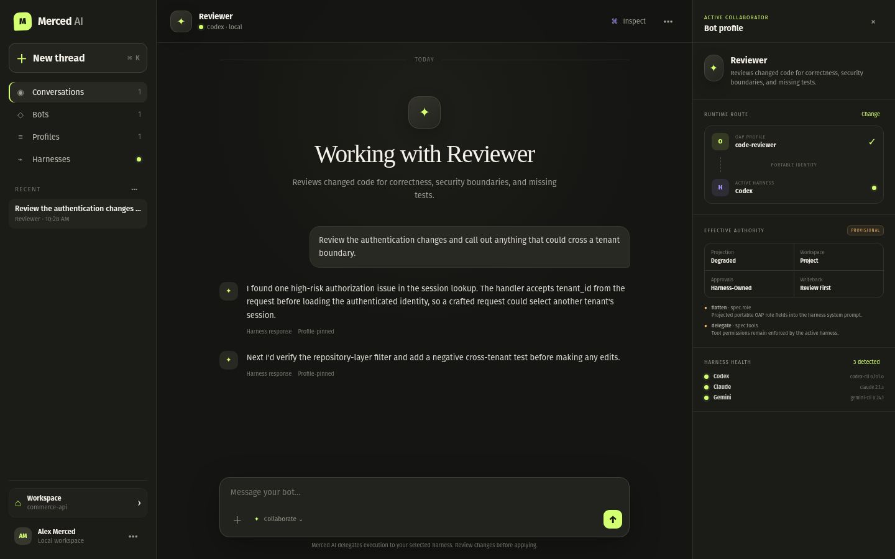

# Merced AI

Merced AI is a local-first broker for AI agent harnesses already installed on your machine. It
discovers those harnesses, normalizes their noninteractive interfaces, and uses Open Agent Profile
(OAP) documents to create portable bots you can chat and collaborate with.

Merced AI is deliberately not another agent loop. The selected harness still owns model access,
tools, authentication, sandboxing, approvals, and final policy enforcement.

## MVP capabilities

- Safe executable and version discovery for 14 harnesses, including Codex, Claude Code, Gemini CLI,
  OpenCode, Goose, Loro, MagAgent, DSH, Pi, Prime Agent, OpenClaw, and Kimi Code CLI.
- Reference OAP validation, digest calculation, profile discovery, and minimal profile authoring.
- Project-local and user-global bot bindings with preferred and fallback harnesses.
- Honest native, projected, degraded, and unsupported profile projection reports.
- One-shot bot runs, multi-turn local chat, and attributed multi-bot group conversations.
- Durable, atomic project-local conversation sessions with resume support.
- Machine-readable JSON output for inventory, profiles, bots, dry runs, and results.
- Bounded subprocess execution without a shell, with timeout and Ctrl+C cancellation.

## Installation

```bash
python -m pip install merced-ai
# optional UI
python -m pip install 'merced-ai[webui]'
```

For development:

```bash
python -m pip install -e '.[dev]'
merced-ai --version
```

Python 3.11 or newer is required. At least one supported harness must be installed and authenticated
for a real run. Inventory and dry-run workflows do not require model access.

See the [installation guide](docs/INSTALLATION.md) for pipx/uv, platform-specific discovery, and
explicit executable overrides.

## Quick start

Initialize a workspace:

```bash
merced-ai init
merced-ai harness list
```

Create a minimal OAP profile:

```bash
merced-ai profile create reviewer \
  --description "Reviews code for concrete defects before merge." \
  --instructions "Review code. Report verified defects and do not edit files."
```

Bind it to a harness:

```bash
merced-ai bot create reviewer \
  --profile reviewer \
  --harness codex \
  --fallback claude
```

Review the exact projection without launching a model:

```bash
merced-ai ask reviewer "Review the current diff" --dry-run --explain
merced-ai profile effective reviewer --harness codex
```

Run or chat:

```bash
merced-ai ask reviewer "Review the current diff"
merced-ai chat reviewer
merced-ai group chat reviewer builder tester
merced-ai group ask reviewer builder tester --prompt "Give independent assessments" --json
merced-ai session list
merced-ai session resume <session-id>
```

Launch the optional local UI:

```bash
python -m pip install 'merced-ai[webui]'
merced-ai ui
```

The UI binds to loopback and exchanges an ephemeral fragment token for an HTTP-only local session.
It uses the same profile, bot, routing, projection, session, and harness services as the CLI. You
can create profiles and bots, create single or group conversations, target `@mentioned` bots or ask
everyone concurrently, choose routes, approve or cancel runs, inspect authority and harness health,
and search/resume/export attributed transcripts. See the [UI guide](docs/UI.md) and
[group-chat guide](docs/GROUP_CHAT.md) for the security, dispatch, and streaming boundaries.



The layout is responsive down to a compact mobile collaboration view. See the
[mobile UI screenshot](docs/screenshots/merced-ai-ui-mobile.jpg).

Use `-C PATH` on project-aware commands to select another workspace. Use `--json` on read and
one-shot commands for automation.

## Harness matrix

| Harness | Discovery | Execution | OAP projection |
| --- | --- | --- | --- |
| MagAgent | yes | native one-shot | native for project-discovered profiles |
| Loro | yes | native one-shot | native for project-discovered profiles |
| Claude Code | yes | structured print mode | system-prompt projection |
| Codex | yes | noninteractive exec | delimited prompt compatibility mode |
| Gemini CLI | yes | structured headless mode | delimited prompt compatibility mode |
| OpenCode | yes | structured run mode | delimited prompt compatibility mode |
| Goose | yes | structured run mode | system-prompt projection |
| Anton | yes | stdin REPL bridge | delimited prompt compatibility mode |
| DeepSeek Harness (DSH) | yes | headless profile | delimited prompt compatibility mode |
| Antigravity CLI (AGY) | yes | structured print mode | delimited prompt compatibility mode |
| Pi Coding Agent | yes | structured print mode | system-prompt projection |
| Prime Agent | yes | structured print mode | system-prompt projection |
| OpenClaw | yes | embedded local agent | delimited prompt compatibility mode |
| Kimi Code CLI | yes | read-only print mode | delimited prompt compatibility mode |

"Native" means the harness receives the OAP profile name through its own CLI. It does not mean
Merced AI can supersede harness policy. All current projection reports remain provisional until the
runtime handshake and effective-policy reporting milestone is complete.

GLM is treated as a model-family route, not a separate harness. Use it through a supported host
such as Claude Code, OpenCode, Goose, Pi, or Prime Agent. Kimi models can likewise be selected in
multi-provider harnesses, while the dedicated Kimi Code CLI has its own adapter. See
[COMPATIBILITY.md](docs/COMPATIBILITY.md) for qualification status and caveats.

DSH can use a non-DeepSeek provider through its bundled `llm-pi-ai` settings. Kimi can use a
custom config selected with `MERCED_AI_KIMI_CONFIG_FILE`; standard provider environment variables
remain outside Merced AI. See the compatibility guide for a key-free DSH example and current live
qualification results.

## Storage

Project-local data:

```text
.agents/                    OAP profiles
.merced-ai/bots/            bot bindings
.merced-ai/sessions/        normalized conversation sessions
```

User-global data defaults to `~/.config/merced-ai` on Linux and follows the platform configuration
directory on Windows. Set `MERCED_AI_HOME` to override it for automation or tests.

OAP profiles remain the authoritative source for identity and learned state. Session JSON files do
not replace profile state.

## Security posture

- Harness discovery never installs packages or scans the full filesystem.
- Child commands are passed as argument arrays with `shell=False`.
- Plaintext credentials are rejected by the OAP reference validator.
- Harness policies remain authoritative.
- Degraded profile injection is clearly reported and delimited.
- Runs time out, captured output is bounded, and cancellation terminates the child process.
- Automatic fallback happens only when a harness is unavailable, never after a paid or mutating run
  has begun.

See [PRD.md](PRD.md) for the full product requirements, security model, architecture, and roadmap.
The [documentation index](docs/README.md) links configuration, detection, troubleshooting,
architecture, validation, and release guides.

## Development

```bash
ruff format --check .
ruff check .
pytest
python -m build
```

Unit and CLI tests use isolated filesystems and mocked harness processes. They do not call models or
require network access.
