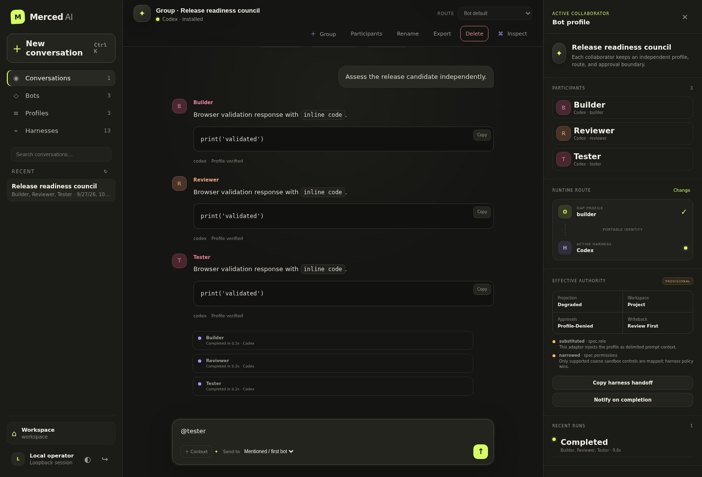

# Merced AI

One portable agent identity across the harnesses you already use, with honest reports of what each one drops.

Current release: 0.7.0 ([release notes](docs/RELEASE_NOTES_0.7.0.md)). Unreleased work is tracked in
the [changelog](CHANGELOG.md).

## Which tool do I want?

Merced AI is one of four related open-source agent projects. Pick by what you are trying to do:

| Goal | Tool |
| --- | --- |
| I want a governed agent for a team or data platform | [Loro](https://github.com/alexmerced-oss/loro) |
| I want a personal agent that remembers me | [MagAgent](https://github.com/AlexMercedCoder/MagAgent) |
| I want a desktop app for my agent | [Mag Command Center](https://github.com/AlexMercedCoder/MagCommandCenter) |
| I already use Claude Code/Codex/Gemini/etc. and want one identity across them | [Merced AI](https://github.com/AlexMercedCoder/merced-ai) |

WebMCP-capable bots can be pinned to native MagAgent or Loro routes; see
[WebMCP routing](docs/WEBMCP.md).

Merced AI is a local-first broker for AI agent harnesses already installed on your machine. It
discovers those harnesses, normalizes their noninteractive interfaces, and uses Open Agent Profile
(OAP) documents to create portable bots you can chat and collaborate with.

Merced AI is deliberately not another agent loop. The selected harness still owns model access,
tools, authentication, sandboxing, approvals, and final policy enforcement.

## Capabilities

- Safe executable and version discovery for 14 harnesses, including Codex, Claude Code, Gemini CLI,
  OpenCode, Goose, Loro, MagAgent, DSH, Pi, Prime Agent, OpenClaw, and Kimi Code CLI.
- Reference OAP validation, digest calculation, profile discovery, and minimal profile authoring.
- Read-only AGS 1.0 validation and deterministic planning with digests, dependency order,
  reachability, worst-case execution bounds, cost/tier summaries, and explicit unsupported features.
- Project-local and user-global bot bindings with preferred and fallback harnesses.
- Honest native, projected, degraded, and unsupported profile projection reports.
- One-shot bot runs, multi-turn local chat, and attributed multi-bot group conversations.
- Durable, atomic project-local conversation sessions with resume support.
- Machine-readable JSON output for inventory, profiles, bots, dry runs, and results.
- Bounded subprocess execution without a shell, with timeout and Ctrl+C cancellation.
- Agent Client Protocol sessions for Claude Code, Gemini CLI, Goose, and OpenCode: streamed
  replies, relayed permission requests, and native session resume where the agent supports it.
- Group rooms that serialize write-capable bots, or give each its own git worktree with a
  compare and apply view.
- Merced AI as an ACP agent for editors (`merced-ai acp`) and an experimental A2A endpoint.
- A reviewed inbox for OAP state deltas, a cross-harness eval mode, and an adapter plugin API.

## Installation

```bash
python -m pip install merced-ai
# optional UI
python -m pip install 'merced-ai[webui]'
```

For development:

```bash
python -m pip install -e '.[dev]'
merced-ai --version
```

Python 3.11 or newer is required. At least one supported harness must be installed and authenticated
for a real run. Inventory and dry-run workflows do not require model access.

See the [installation guide](docs/INSTALLATION.md) for pipx/uv, platform-specific discovery, and
explicit executable overrides.

## Quick start

Initialize a workspace:

```bash
merced-ai init
merced-ai harness list
```

Create a minimal OAP profile:

```bash
merced-ai profile create reviewer \
  --description "Reviews code for concrete defects before merge." \
  --instructions "Review code. Report verified defects and do not edit files."
```

Or generate and review a canonical profile through an installed harness:

```bash
merced-ai profile generate "A cautious release reviewer that cites test evidence"
merced-ai profile generate "A portable documentation specialist" --scope universal
```

The Profiles page exposes the same prompt-driven path. Generation runs a temporary author profile
with tools and consequential permissions denied, compiles the result into OAP 1.0, and validates
it before creation. `~/.agentprofiles` is the universal user root; Merced AI's native user root and
project `.agents` directory take precedence. Native MagAgent and Loro sessions can also use the
bundled `oap-profile-authoring` workflow to propose profiles for subagents without silently
activating new authority.

Bind it to a harness:

```bash
merced-ai bot create reviewer \
  --profile reviewer \
  --harness codex \
  --fallback claude
```

Review the exact projection without launching a model:

```bash
merced-ai ask reviewer "Review the current diff" --dry-run --explain
merced-ai profile effective reviewer --harness codex
```

When a harness receives the profile as prompt context rather than natively, the report lists each
profile section that the run does not carry as `dropped`: MCP servers, skills, tool allow and deny
lists, permission rules, filesystem roots, host allowlists, context files and documents, memory
stores, runtime limits, lifecycle hooks, and model tier or parameters. Sections marked
`required: true` are named, because such a run is not the whole profile.

Run or chat:

```bash
merced-ai ask reviewer "Review the current diff"
merced-ai chat reviewer
merced-ai group chat reviewer builder tester
merced-ai group ask reviewer builder tester --prompt "Give independent assessments" --json
# Write-capable bots in the same workspace take turns; opt out with --allow-concurrent-writes
merced-ai session list
merced-ai session resume <session-id>
```

When MagAgent, Loro, or an ACP agent asks for approval during `ask`, `chat`, or a group command,
the request appears in the terminal: the exact action and arguments, its risk, and the bot and
harness that asked. Press a number to choose; Enter, Esc, and Ctrl-C deny. The decision is
recorded through the same AAIS presenter as the web UI. Without an interactive terminal (piped
input, CI) the request is denied and one line on stderr says so.

Launch the optional local UI:

```bash
python -m pip install 'merced-ai[webui]'
merced-ai ui
```

The UI binds to loopback and exchanges an ephemeral fragment token for an HTTP-only local session.
It uses the same profile, bot, routing, projection, session, and harness services as the CLI. You
can create profiles and bots, create single or group conversations, target `@mentioned` bots or ask
everyone concurrently, choose routes, approve or cancel runs, inspect authority and harness health,
and search/resume/export attributed transcripts. Group setup has searchable ordered selection,
progressive per-bot status, exact failed-bot retry, `@mention` completion, stable identities,
conversation naming, and derived participant sets. Workspace data renders before executable
probing; cached harness health then refreshes progressively in the background. The composer can
attach bounded project files and browser uploads, recent durable run records show context/events/
duration/partial failures, completion notifications are opt-in, and each active route exposes a
copyable native-harness handoff command. See the
[UI guide](docs/UI.md) and
[group-chat guide](docs/GROUP_CHAT.md) for the security, dispatch, and streaming boundaries.



The layout is responsive down to a compact mobile collaboration view. See the
[mobile group-chat screenshot](docs/screenshots/merced-ai-group-mobile.jpg).

Compare harnesses on the same profile with `merced-ai eval run -p PROFILE --prompt "..." -H claude
-H codex --contains ...` or the **Compare harnesses** page; see [Comparing harnesses](docs/EVALS.md).

Editors and other agents can drive a bot or a room too: `merced-ai acp --bot reviewer` serves it
as an Agent Client Protocol agent (for example in Zed), and `merced-ai ui` also exposes an
experimental A2A endpoint. See [Serving Merced AI](docs/SERVING.md).

Use `-C PATH` on project-aware commands to select another workspace. Use `--json` on read and
one-shot commands for automation.

## Standards support

Merced AI uses `open-agent-profile>=1.0.1,<2`, `agentic-graph-spec>=1.0.1,<2`, and
`agent-approval-interchange>=0.1.0,<0.3`. It claims OAP 1.0 Level 1 as a broker and AGS 1.0 Level 0 as a
read-only parser/planner. Merced AI does not execute AGS graphs, apply OAP state deltas, or replace
the selected harness's final policy enforcement. See the [OAP conformance result](docs/oap-conformance.json),
[AGS conformance result](docs/ags-conformance.json), and [Agentic Graph guide](docs/AGENTIC_GRAPHS.md)
for the pinned revisions and exact boundary.

## Harness matrix

| Harness | Discovery | Execution | OAP projection | Prompt delivery |
| --- | --- | --- | --- | --- |
| MagAgent | yes | one-shot with AAIS approval relay | native for project-discovered profiles | private file (`--prompt-file`) on MagAgent with that flag; argument on older MagAgent |
| Loro | yes | one-shot with AAIS approval relay | native for project-discovered profiles | private file (`--prompt-file`) on Loro with that flag; argument on older Loro |
| Claude Code | yes | ACP session via `claude-agent-acp` (streaming, approvals, resume), else structured print mode | system-prompt projection (delimited prompt over ACP) | stdin; system prompt via private file |
| Codex | yes | noninteractive exec | delimited prompt compatibility mode | stdin (`exec -`) |
| Gemini CLI | yes | ACP session via `gemini --acp` (streaming, approvals), else structured headless mode | delimited prompt compatibility mode | stdin |
| OpenCode | yes | ACP session via `opencode acp` (streaming, approvals, resume), else structured run mode | delimited prompt compatibility mode | stdin |
| Goose | yes | ACP session via `goose acp` (streaming, approvals, resume), else structured run mode | system-prompt projection (delimited prompt over ACP) | stdin (`--instructions -`); system prompt as argument |
| Anton | yes | stdin REPL bridge | delimited prompt compatibility mode | stdin |
| DeepSeek Harness (DSH) | yes | headless profile | delimited prompt compatibility mode | argument |
| Antigravity CLI (AGY) | yes | structured print mode | delimited prompt compatibility mode | argument |
| Pi Coding Agent | yes | structured print mode | system-prompt projection | stdin; system prompt via private file |
| Prime Agent | yes | structured print mode | system-prompt projection | stdin; system prompt via private file |
| OpenClaw | yes | embedded local agent | delimited prompt compatibility mode | private file (`--message-file`) |
| Kimi Code CLI | yes | read-only print mode | delimited prompt compatibility mode | stdin |

Prompts travel over stdin or a private temporary file wherever the harness accepts one, so long
conversations and attached context are not limited by the operating system's command-line size.
Harnesses that take the prompt only as an argument are guarded: Merced AI refuses a command line
over 100 KB (24 KB on Windows) with a clear error instead of failing to start the process. See
[prompt delivery](docs/COMPATIBILITY.md#prompt-delivery) for the per-harness evidence.

Claude Code, Gemini CLI, Goose, and OpenCode run over the Agent Client Protocol when their ACP
launcher is installed: replies stream, permission requests come to you, and (except Gemini) the
next turn resumes the harness's own session. Other adapters run one noninteractive subprocess per
turn: replies appear when the harness finishes, and each turn replays a bounded transcript. The
Harnesses screen and `merced-ai harness show` list what Merced AI delivers separately from what the
harness offers on its own; see [Harness compatibility](docs/COMPATIBILITY.md).

"Native" means the harness receives the OAP profile name through its own CLI. It does not mean
Merced AI can supersede harness policy. Projection labels describe Merced AI's broker behavior, not
certification of a selected harness's effective runtime. Native handoff remains bounded by that
harness's own policy and diagnostics.

Other harnesses can be added as installed plugins without changing Merced AI; see
[Harness adapter plugins](docs/PLUGINS.md).

GLM is treated as a model-family route, not a separate harness. Use it through a supported host
such as Claude Code, OpenCode, Goose, Pi, or Prime Agent. Kimi models can likewise be selected in
multi-provider harnesses, while the dedicated Kimi Code CLI has its own adapter. See
[COMPATIBILITY.md](docs/COMPATIBILITY.md) for qualification status and caveats.

DSH can use a non-DeepSeek provider through its bundled `llm-pi-ai` settings. Kimi can use a
custom config selected with `MERCED_AI_KIMI_CONFIG_FILE`; standard provider environment variables
remain outside Merced AI. See the compatibility guide for a key-free DSH example and current live
qualification results.

## Storage

Project-local data:

```text
.agents/                    OAP profiles
.merced-ai/bots/            bot bindings
.merced-ai/sessions/        normalized conversation sessions
~/.agentprofiles/           portable user profiles shared by compatible harnesses
```

User-global data defaults to `~/.config/merced-ai` on Linux and follows the platform configuration
directory on Windows. Set `MERCED_AI_HOME` to override it for automation or tests.

OAP profiles remain the authoritative source for identity and learned state. Session JSON files do
not replace profile state. Changes to a profile's learned state arrive as OAP state deltas and wait
in a reviewed inbox (`merced-ai inbox`, or **Inbox** in the web UI) until you approve them; see
[OAP state inbox](docs/INBOX.md).

## Security posture

- Harness discovery never installs packages or scans the full filesystem.
- Child commands are passed as argument arrays with `shell=False`. Prompt files live in a
  per-run private temporary directory (mode `0600` on POSIX) and are removed when the run ends.
- Plaintext credentials are rejected by the OAP reference validator.
- Harness policies remain authoritative.
- Degraded profile injection is clearly reported and delimited.
- Runs time out, captured output is bounded, and cancellation terminates the child process.
- Automatic fallback happens only when a harness is unavailable, never after a paid or mutating run
  has begun.

See [PRD.md](PRD.md) for the full product requirements, security model, architecture, and roadmap.
The [documentation index](docs/README.md) links configuration, detection, troubleshooting,
architecture, validation, and release guides.

## Development

```bash
ruff format --check .
ruff check .
mypy
pytest
python -m build
```

Unit and CLI tests use isolated filesystems and mocked harness processes. They do not call models or
require network access.
